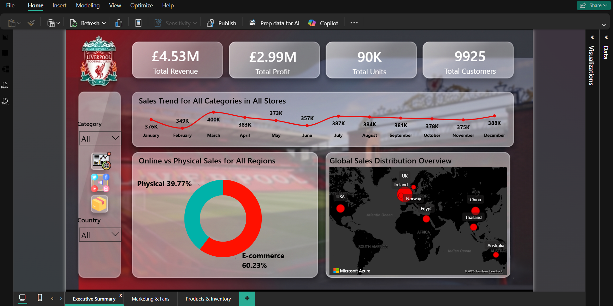
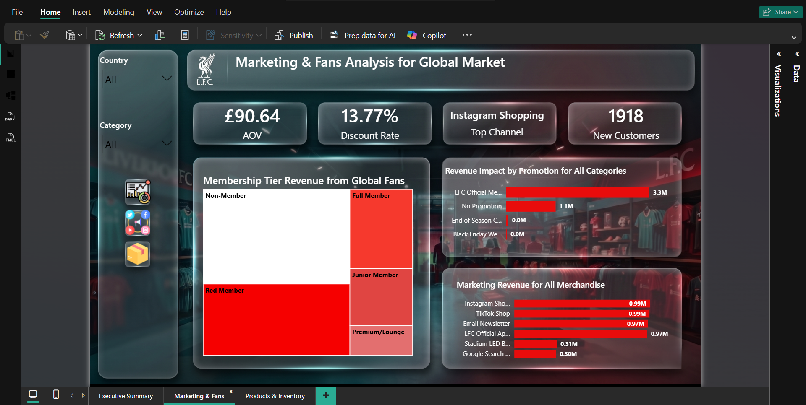
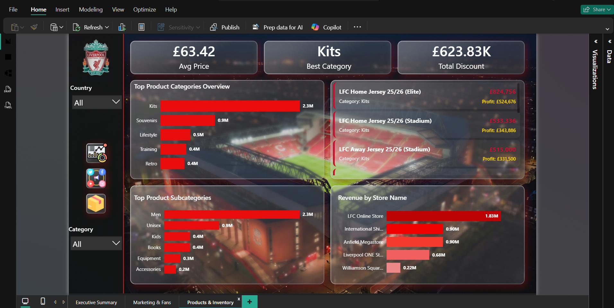

# 🔴 Liverpool FC Official Store - 2025 Marketing Analytics Dashboard
## 📊 Project Overview
This project features a high-fidelity **Power BI Dashboard** designed to analyze the marketing and sales performance of the **Liverpool FC Official Store** for the year 2025. The dataset consists of **50,000+ transactions**, covering global sales, fan demographics, and marketing channel ROI.

### 🔗 Live Demo
You can interact with the live dashboard here: 
[**Live Power BI Report**](https://app.powerbi.com/view?r=eyJrIjoiMWQ3NzYyZjAtZDFmMy00ZDA0LTk1Y2UtY2I4ZDM5MGU4ZTEzIiwidCI6ImVhZjYyNGM4LWEwYzQtNDE5NS04N2QyLTQ0M2U1ZDc1MTZjZCIsImMiOjh9)

---

## 📸 Dashboard Preview
| Executive Summary | Marketing & Fans | Products & Inventory |
|---|---|---|
|  |  |  |

---

## 🛠️ Key Features
- **Star Schema Architecture**: Optimized data model with Fact and Dimension tables for high performance.
- **Dynamic UX/UI**: Implementation of **Glassmorphism** design and custom HTML/CSS for a modern app-like feel.
- **Advanced DAX**: 
  - Dynamic titles that change based on slicer selections.
  - Custom measures for Profit Margin, AOV, and Marketing ROI.
  - Conditional formatting for visual storytelling.
- **Omnichannel Insights**: Comparison between Online (E-commerce) and Physical store performance.
---

## 💡 Strategic Recommendations (Actionable Insights)
1. **Fan Conversion Strategy**: Implement a **Retargeting Campaign** specifically for "Non-Members" who purchased Kits (the top-selling category). Offering a tiered discount for joining the "Red Membership" can convert one-time buyers into loyal, long-term fans.
2. **Geographical Expansion**: With **International Shipping** matching the revenue of the Anfield Megastore (~£0.9M), establishing a **Distribution Hub in Asia** (specifically targeting the high-growth Thai market) would reduce shipping costs and delivery times, potentially doubling regional sales.
3. **Social Commerce Optimization**: Since Instagram and TikTok are the highest-performing marketing channels, launching **Exclusive Social Bundles** (e.g., Jersey + Cap + Scarf) priced at £110+ can further increase the **Average Order Value (AOV)** from its current £90.64.
4. **Smart Inventory Management**: Ensure high stock levels for the **"Home Jersey (Elite)"** during peak months (March and October). As the most profitable item, any "Out of Stock" scenario during these peaks represents a significant loss in net profit.
5. **Cross-selling Underperforming Categories**: To move slow-moving inventory in **Accessories and Equipment**, implement a **Cross-selling Algorithm** that offers these items at a 10% discount when a customer adds "Training Wear" to their cart.
---

## 📁 Repository Structure
- `/Dataset_files`: Contains the raw CSV data (Sales, Products, Customers, etc.).
- `/lfc_assets`: High-quality logos and background UI assets.
- `LFC_STORE.pbix`: The main Power BI project file.
- `README.md`: Project documentation.

## 📈 Insights Covered
- **Revenue Analysis**: £4.5M+ total revenue with monthly trend tracking.
- **Fan Demographics**: Analysis of 10,000+ global fans across different membership tiers (Full, Red, Premium).
- **Marketing Performance**: ROI tracking for TikTok Shop, Instagram Shopping, and Stadium LED boards.
- **Product Strategy**: Deep dive into top-selling categories like Kits, Training Wear, and Retro collections.

---
**Note**: The dataset used in this project is synthetic (AI-generated) and is intended solely for educational and portfolio demonstration purposes. 

---
**Developed by: Mohamed Shaikhoun** 

---
*You'll Never Walk Alone 🔴*
